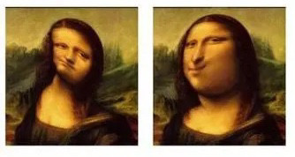

# 如何避免身边人抱怨带来的负能量
**#负能量#**

****
有大学同学总是在我身边抱怨这群学校有多垃圾，说的话实在是难听，我就在想，认为学校垃圾你去考个牛逼的学校啊，没那考清北的能力还有脸抱怨。

每次这么想，脑子里都会充满负能量，感觉心里总是解不开的结，实在是不知道如何是好了

在这解释一下，我和同学来自不同的省份，我高考以校20名的成绩进的大学，但是他确是校几千名进来的，我本来感觉自己的大学不错，没想到会遇到这样的事，心中的不平衡更加强烈了
****

****

这个问题问得有点模糊。这是要避免人说出悲观沮丧的话，还是要避免受到这些悲观沮丧的话的影响？

鉴于人一般情况下没有权利干预别人的行为，所以我们姑且认为是后者。

这个其实是一个比较重要的修炼——那就是年轻人常常把其他人说的话的默认价值看得太大。

实际上，大多数人对大多数事情的判断都是不可信的。对事物有周全深刻的观察能力，对问题有敏捷犀利的理解和破解能力，对表达有严谨恰当的表达能力，这是一个人值得你投入时间和精力去在意其输出的及格线。

这三个能力其实就是你要知道你在看什么，你要知道怎么去想，想到了之后还要知道如何无歧义、无错漏的说出来。

这三条中的任何一条做不到，说出来的话就会成为不自知的胡言乱语。

你得从ta错成什么样了，去反猜ta看到的是什么，脑袋里在想什么，实际上想说的是什么。这很像一个人对着哈哈镜的影像去反猜原本的人长什么样。

然而，做过这三种磨练并且学有所成、运用自如的人，非常遗憾，极其的少见。

你如果见到了，你会发现这类人是很少说什么“负能量”的话的。因为这些人遇到的足以绝望的沮丧很少，自然就没啥这种呻吟，于是这种烦恼自然也就对你不存在了。

这意味着什么呢？

意味着一天到晚止不住的往外冒负能量的人，大概率不是这种训练有素的人。

看明白没有？

答案很明显了，无视这类噪音，且不要担心自己错过了什么真理，这背后是有逻辑支撑的，不是你自己“傲慢”。

其实你总忍不住要去信上一信，是因为你害怕自己真的不屑一顾“会不会太傲慢”，不是吗？

那么认定三角形内角和为180度叫不叫傲慢？

有逻辑支撑的否定——这包括出于理性选择赢面较大或预期利润更大的方案——不叫傲慢，叫实事求是，叫明智选择。

以前劝你不要在意，那只是空劝，对你没用。

现在这里道理给你讲明白了，不要在意，这是有根据的叫你不要在意。

对一切没有这三种训练痕迹的人都不要在意。

ta们不停的在沮丧悲观和乐观得脸发红之间摇摆属于正常现象，无论是高兴还是焦虑的话，都没有参考价值。

